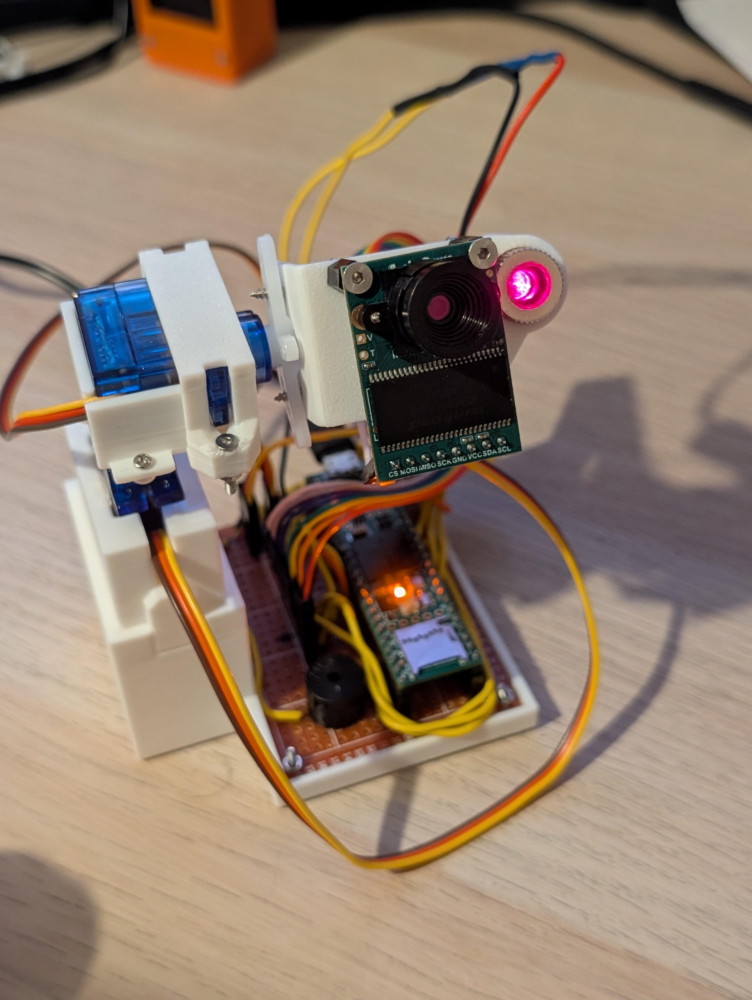

# Real-time embedded vision system with optimized C++ for resource limited hardware.

This project demonstrates edge based computing in the context of machine vision, implemented on a microcontroller that features a powerful ARM Cortex-M7 processor. The system makes use of algorithmic and memory optimizations in C++ to enable image processing under strict hardware constraints.

This is still work in progress but the aims are to achieve a constant and high framerate with tracking and limited path prediction features. 

